# Voice Call 聊天过程关键节点日志分析

本文档详细分析了 Voice Call 语音通话过程中的关键日志节点，包括时序图、状态机、逻辑分支和日志表。

## 目录

- [1. 系统架构概览](#1-系统架构概览)
- [2. 完整通话时序图](#2-完整通话时序图)
- [3. CallFsm 状态机](#3-callfsm-状态机)
- [4. 关键节点日志详解](#4-关键节点日志详解)
- [5. 逻辑分支流程图](#5-逻辑分支流程图)
- [6. 日志搜索指南](#6-日志搜索指南)

---

## 1. 系统架构概览

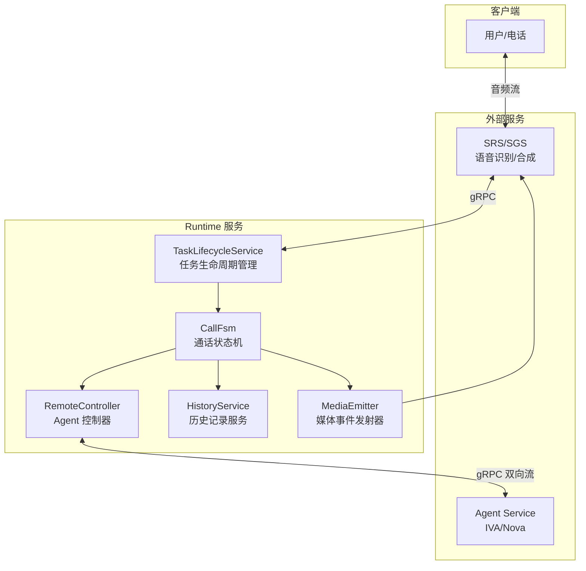

### 核心组件职责

| 组件                   | 文件路径                                    | 职责                          |
| ---------------------- | ------------------------------------------- | ----------------------------- |
| `TaskLifecycleService` | `src/tel/task/TaskLifecycleService.ts`      | 任务生命周期管理，协调各组件  |
| `CallFsm`              | `src/tel/fsm/CallFsm.ts`                    | 核心状态机，处理通话逻辑      |
| `RemoteController`     | `src/agent/controllers/RemoteController.ts` | 与 Agent Service 的 gRPC 通信 |
| `SrsHandler`           | `src/srs/SrsHandler.ts`                     | 语音识别/合成事件处理         |
| `MediaEmitter`         | `src/srs/MediaEmitter.ts`                   | 媒体事件发射器                |

---

## 2. 完整通话时序图

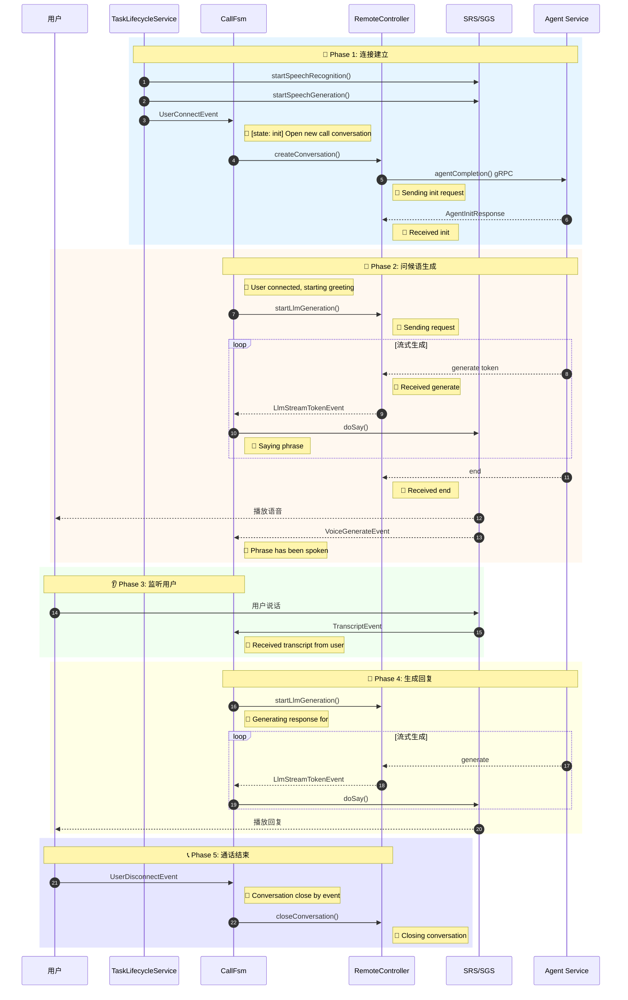

---

## 3. CallFsm 状态机

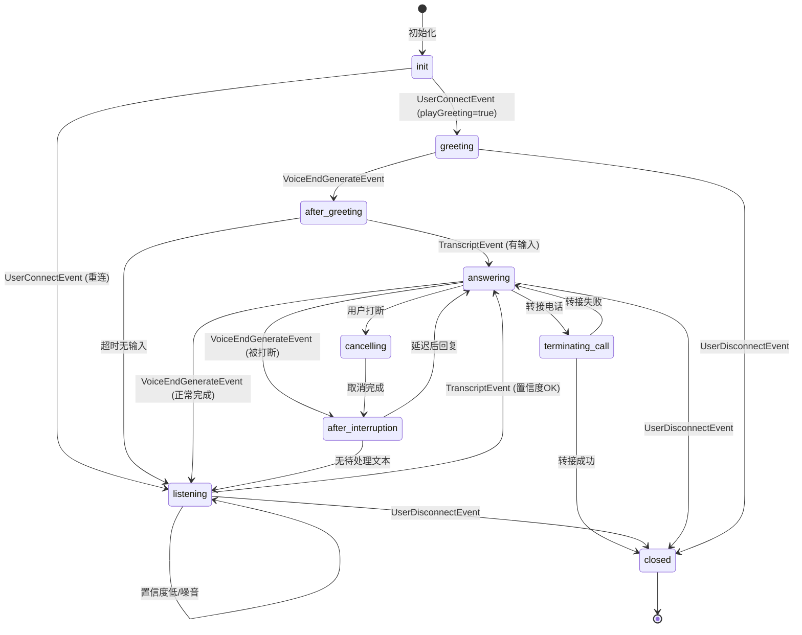

### 状态说明

| 状态                 | 说明           | 主要日志                                   |
| -------------------- | -------------- | ------------------------------------------ |
| `init`               | 初始状态       | `Open new call conversation`               |
| `greeting`           | 播放问候语     | `Generating greeting`, `Saying phrase`     |
| `after-greeting`     | 问候后等待输入 | `Collecting phrases after greeting`        |
| `listening`          | 监听用户说话   | `Received transcript from user`            |
| `answering`          | AI 正在回答    | `Generating response for`, `Saying phrase` |
| `cancelling`         | 取消当前生成   | `Clearing speech resources`                |
| `after-interruption` | 打断后收集输入 | `Collecting phrases after interruption`    |
| `terminating-call`   | 正在转接电话   | `Terminating call started`                 |
| `closed`             | 通话结束       | `Conversation close by event`              |

---

## 4. 关键节点日志详解

### 4.1 连接建立阶段

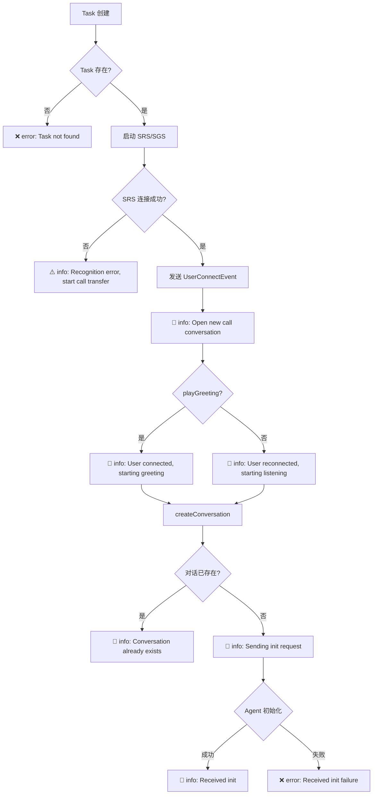

| 日志级别 | 日志内容                                   | 说明                   |
| -------- | ------------------------------------------ | ---------------------- |
| `info`   | `[state: init] Open new call conversation` | 开始新通话             |
| `info`   | `User connected, starting greeting`        | 新用户，播放问候语     |
| `info`   | `User reconnected, starting listening`     | 重连用户，直接监听     |
| `info`   | `Sending init request {...}`               | 发送初始化请求到 Agent |
| `info`   | `Received init: {...}`                     | Agent 初始化成功       |
| `error`  | `Received init failure`                    | Agent 初始化失败       |
| `error`  | `Task not found`                           | Task ID 不存在         |

### 4.2 问候语生成阶段

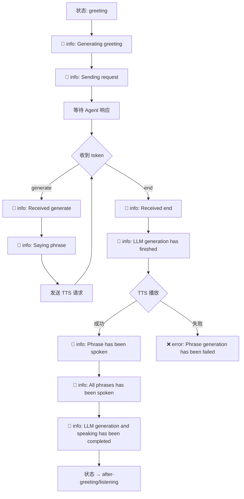

### 4.3 监听阶段 (TranscriptEvent 处理)

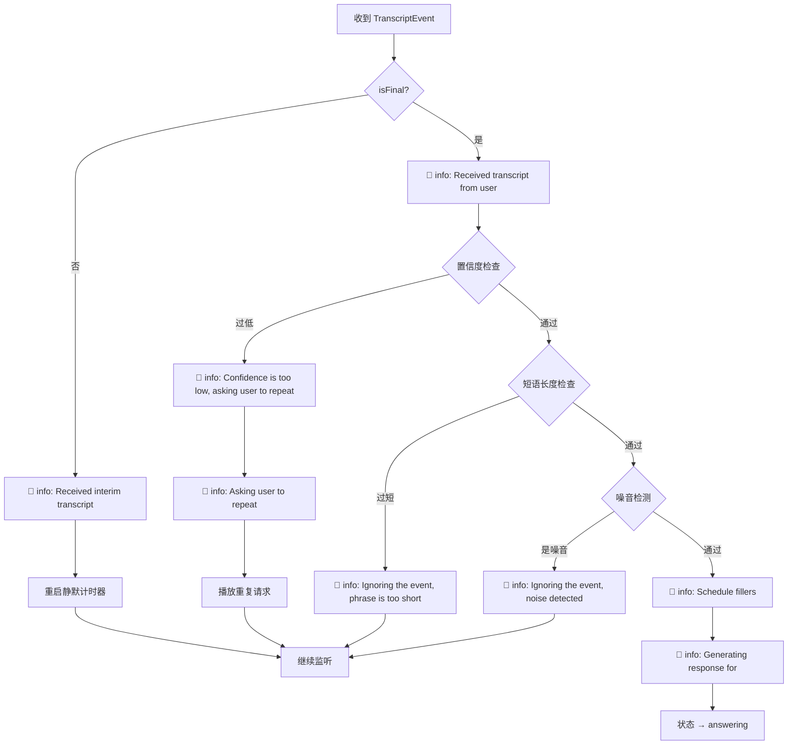

### 4.4 回复生成阶段

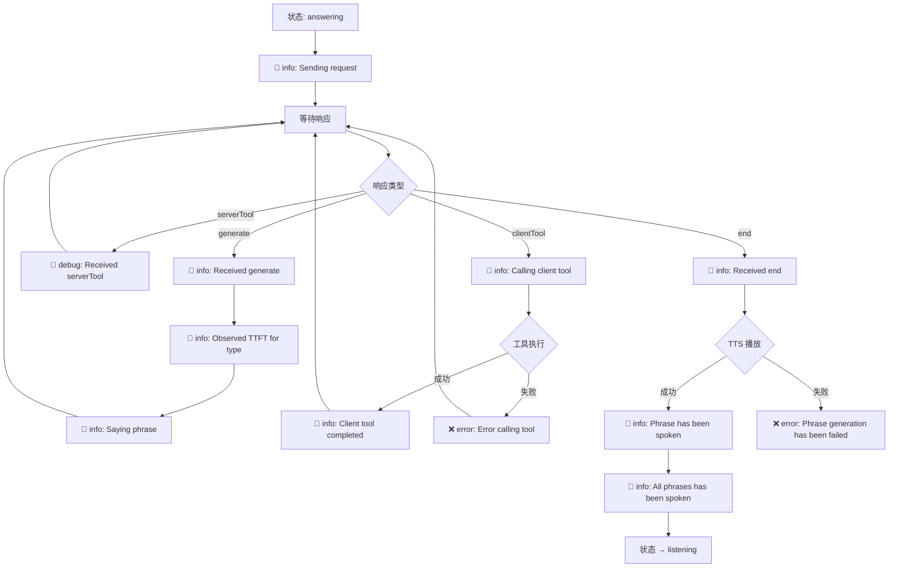

#### 工具调用跨组件链路（NCA → AIG → Agent Service）

在上述回复生成阶段中，如果 Agent 需要调用工具（`serverTool` / `clientTool` 分支），实际会穿过 IVA / Nova 的多个组件：

1. **Agent Service (`agent_service`)**  
   - 日志索引：`*:*-logs-air_agent_service-*`  
   - 通过 `conversationId` 与 Assistant Runtime 中的 `conversation_id` 对齐  
   - 关键日志：`serverTool`、`clientTool`、`tool completed`、`Error calling ... tool`

2. **NCA (`nca`)**  
   - 日志索引：`*:*-logs-nca-*`  
   - 同样使用 `conversation_id` 过滤  
   - 为每次工具调用生成并记录 `request_id`，包含工具调度和对话状态

3. **AIG (`aig`)**  
   - 日志索引：`*:*-logs-aig-*`  
   - 通过 `request_id` 与 NCA 日志关联（`NCA.request_id = AIG.request_id`）  
   - 记录具体的 LLM / 工具调用、延迟和错误信息

字段关联关系（与 [IVA Session Log Correlation](../../docs/log-correlation.md) 保持一致）：

| 源组件            | 目标组件      | 关联方式                              |
| ----------------- | ------------- | ------------------------------------- |
| assistant_runtime | agent_service | `conversation_id` = `conversationId`  |
| assistant_runtime | nca           | `conversation_id` = `conversation_id` |
| nca               | aig           | `request_id` = `request_id` (直接匹配) |

结合上面的时序图，排查一次工具调用问题时推荐按以下步骤关联 NCA → AIG → Agent Service 日志：

1. 在 Assistant Runtime / Voice Call 日志中，根据 `conversation_id` 和 `serverTool` / `clientTool` 关键字定位到一次工具调用。
2. 使用同一个 `conversation_id`，在 `agent_service` 和 `nca` 日志中查找对应的调用记录（会看到生成的 `request_id`）。
3. 从 NCA 日志中拿到该次调用的 `request_id`，在 `aig` 日志中搜索相同的 `request_id`，查看具体工具执行情况（包括超时、错误等），从而串联起完整链路：**NCA → AIG → Agent Service**。

### 4.5 用户打断阶段

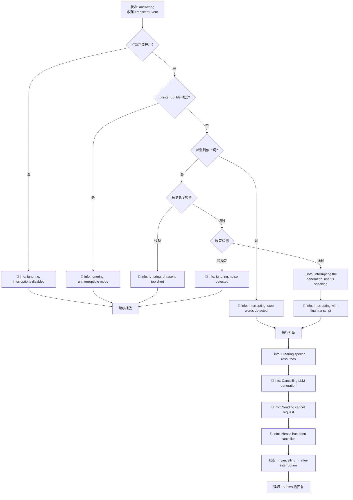

### 4.6 通话结束阶段

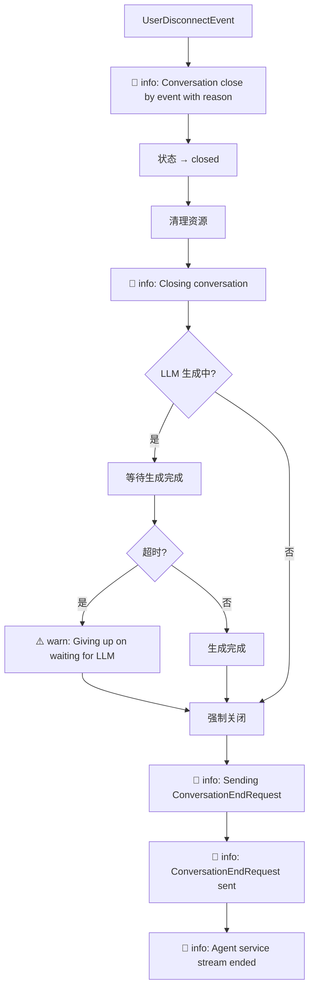

---

## 5. 逻辑分支流程图

### 5.1 完整通话流程总览

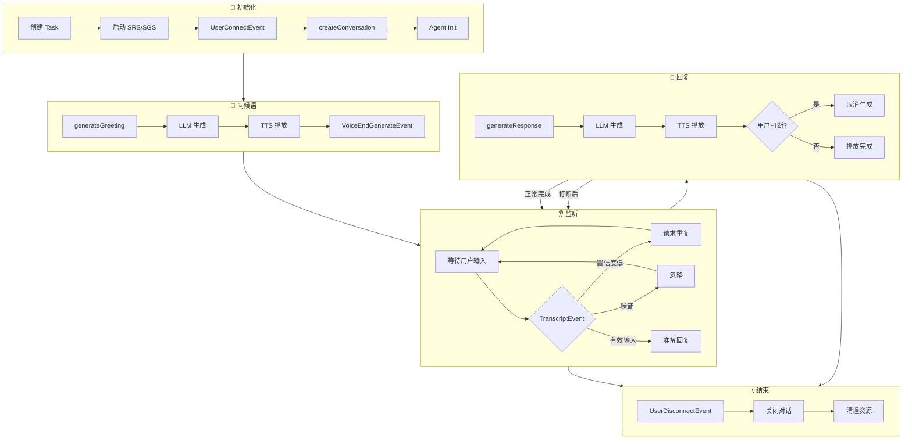

### 5.2 错误处理流程

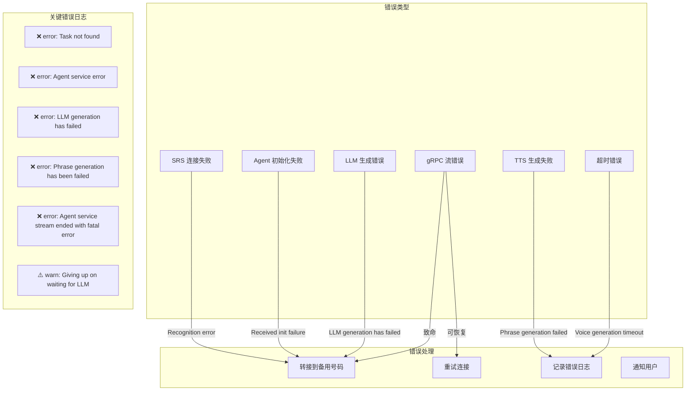

---

## 6. 日志搜索指南

### 6.1 按阶段搜索日志

```bash
# 查看完整通话流程
grep -E "Open new call|starting greeting|Generating greeting|Received transcript|Generating response|Conversation close" logs.txt

# 查看连接建立
grep -E "Open new call|Sending init|Received init" logs.txt

# 查看语音生成
grep -E "Saying phrase|Phrase has been spoken|All phrases" logs.txt

# 查看用户输入
grep -E "Received.*transcript|TranscriptEvent" logs.txt
```

### 6.2 按问题类型搜索

```bash
# 查看所有错误
grep -E "error|failed|timeout|fatal" logs.txt

# 查看用户打断
grep -E "Interrupting|cancelled|cancel" logs.txt

# 查看低置信度/噪音过滤
grep -E "Confidence is too low|noise detected|phrase is too short" logs.txt

# 查看状态变化
grep -E "\[state:" logs.txt

# 查看工具调用
grep -E "clientTool|serverTool|Calling client tool|tool completed" logs.txt
```

### 6.3 按 conversationId 过滤

```bash
# 替换 YOUR_CONVERSATION_ID 为实际 ID
grep "YOUR_CONVERSATION_ID" logs.txt
```

### 6.4 关键指标日志

```bash
# 查看 TTFT (Time To First Token)
grep "Observed TTFT" logs.txt

# 查看超时
grep -E "timeout|DEADLINE_EXCEEDED" logs.txt

# 查看重连
grep "Restarting agent service stream" logs.txt
```

---

## 7. 完整日志表

### 7.1 正常流程日志

| 阶段 | 状态      | 日志级别 | 日志内容                                            | 来源             |
| ---- | --------- | -------- | --------------------------------------------------- | ---------------- |
| 连接 | init      | `info`   | `Open new call conversation`                        | CallFsm          |
| 连接 | init      | `info`   | `User connected, starting greeting`                 | CallFsm          |
| 连接 | -         | `info`   | `Sending init request {...}`                        | RemoteController |
| 连接 | -         | `info`   | `Received init: {...}`                              | RemoteController |
| 问候 | greeting  | `info`   | `Generating greeting ...`                           | CallFsm          |
| 问候 | greeting  | `info`   | `Saying phrase: ...`                                | CallFsm          |
| 问候 | greeting  | `info`   | `Received generate: {...}`                          | RemoteController |
| 问候 | greeting  | `info`   | `LLM generation has finished`                       | CallFsm          |
| 问候 | greeting  | `info`   | `Phrase has been spoken: ...`                       | CallFsm          |
| 问候 | greeting  | `info`   | `All phrases has been spoken`                       | CallFsm          |
| 监听 | listening | `info`   | `Received interim transcript from user`             | CallFsm          |
| 监听 | listening | `info`   | `Received transcript from user`                     | CallFsm          |
| 回复 | answering | `info`   | `Schedule fillers in state: listening`              | CallFsm          |
| 回复 | answering | `info`   | `Generating response for: ...`                      | CallFsm          |
| 回复 | answering | `info`   | `Sending request {...}`                             | RemoteController |
| 回复 | answering | `info`   | `Observed TTFT for type: ...ms`                     | RemoteController |
| 回复 | answering | `info`   | `Saying phrase: ...`                                | CallFsm          |
| 回复 | answering | `info`   | `Phrase has been spoken: ...`                       | CallFsm          |
| 结束 | closed    | `info`   | `Conversation close by event: ... with reason: ...` | CallFsm          |
| 结束 | -         | `info`   | `Closing conversation ...`                          | RemoteController |
| 结束 | -         | `info`   | `Agent service stream ended`                        | RemoteController |

### 7.2 打断流程日志

| 阶段 | 状态               | 日志级别 | 日志内容                                          | 来源             |
| ---- | ------------------ | -------- | ------------------------------------------------- | ---------------- |
| 打断 | answering          | `info`   | `Interrupting the generation, user is speaking`   | CallFsm          |
| 打断 | answering          | `info`   | `Interrupting with final transcript: ...`         | CallFsm          |
| 打断 | cancelling         | `info`   | `Clearing speech resources`                       | CallFsm          |
| 打断 | -                  | `info`   | `Cancelling LLM generation for conversation: ...` | RemoteController |
| 打断 | -                  | `info`   | `Sending cancel request {...}`                    | RemoteController |
| 打断 | cancelling         | `info`   | `Phrase has been cancelled: ...`                  | CallFsm          |
| 打断 | after-interruption | `info`   | `Collecting phrases after interruption ...`       | CallFsm          |

### 7.3 异常/过滤日志

| 场景     | 日志级别 | 日志内容                                           | 来源    |
| -------- | -------- | -------------------------------------------------- | ------- |
| 置信度低 | `info`   | `Confidence is too low, asking user to repeat`     | CallFsm |
| 噪音     | `info`   | `Ignoring the event, noise detected`               | CallFsm |
| 短语过短 | `info`   | `Ignoring the event, phrase is too short`          | CallFsm |
| 停止词   | `info`   | `Interrupting the generation, stop words detected` | CallFsm |
| 打断禁用 | `info`   | `Ignoring the event, interruptions are disabled`   | CallFsm |
| 不可打断 | `info`   | `Ignoring the event, uninterruptible mode`         | CallFsm |

### 7.4 错误日志

| 场景         | 日志级别 | 日志内容                                                | 来源                 |
| ------------ | -------- | ------------------------------------------------------- | -------------------- |
| Task 不存在  | `error`  | `Task not found`                                        | TaskLifecycleService |
| Agent 错误   | `error`  | `Agent service error: ...`                              | RemoteController     |
| 初始化失败   | `error`  | `Received init failure`                                 | RemoteController     |
| LLM 失败     | `error`  | `LLM generation has failed: ...`                        | CallFsm              |
| TTS 失败     | `error`  | `Phrase generation has been failed: ...`                | CallFsm              |
| 工具调用失败 | `error`  | `Error calling ... tool: ...`                           | RemoteController     |
| gRPC 流关闭  | `error`  | `Cannot send generation request, GRPC stream is closed` | SrsHandler           |
| 致命错误     | `error`  | `Agent service stream ended with fatal error`           | RemoteController     |
| 等待超时     | `warn`   | `Giving up on waiting for LLM generation to finish`     | RemoteController     |
| 语音超时     | `info`   | `Voice generation timeout`                              | CallFsm              |

---

## 8. 时间线示例

一个典型的成功通话日志时间线：

```
[00:00.000] [state: init] Open new call conversation
[00:00.010] [state: init] User connected, starting greeting
[00:00.015] Sending init request {...}
[00:00.050] Received init: {...}
[00:00.055] [state: greeting] Generating greeting ...
[00:00.060] Sending request {...}
[00:00.150] Received generate: {...}
[00:00.155] [state: greeting] Saying phrase: "您好，..."
[00:00.300] Received generate: {...}
[00:00.305] [state: greeting] Saying phrase: "请问有什么..."
[00:00.400] Received end: {...}
[00:00.405] [state: greeting] LLM generation has finished
[00:01.500] [state: greeting] Phrase has been spoken: "您好，..."
[00:02.800] [state: greeting] Phrase has been spoken: "请问有什么..."
[00:02.805] [state: greeting] All phrases has been spoken
[00:02.810] LLM generation and speaking has been completed
[00:05.000] [state: listening] Received interim transcript from user
[00:06.500] [state: listening] Received transcript from user
[00:06.510] [state: listening] Schedule fillers in state: listening
[00:06.515] [state: answering] Generating response for: "我想查询..."
[00:06.520] Sending request {...}
[00:06.700] Received generate: {...}
[00:06.702] Observed TTFT for type text: 180ms
[00:06.705] [state: answering] Saying phrase: "好的，..."
[00:07.500] Received end: {...}
[00:08.200] [state: answering] Phrase has been spoken: "好的，..."
[00:08.205] [state: answering] All phrases has been spoken
[00:15.000] Conversation close by event: UserDisconnectEvent with reason: user_hangup
[00:15.005] Closing conversation ...
[00:15.010] Sending ConversationEndRequest for conversation ...
[00:15.015] ConversationEndRequest sent for conversation ...
[00:15.050] Agent service stream ended
```
