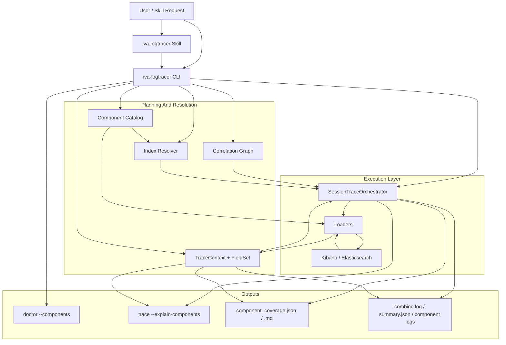
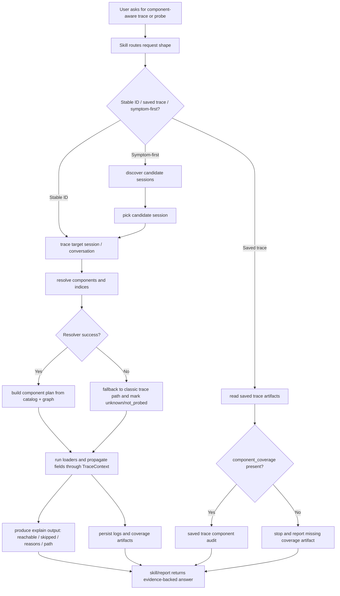

# IVA Logtracer Component Index And Correlation Design

## Status

Reviewed draft

## Context

`iva-logtracer` currently works as a static loader pipeline:

- each loader owns its own `index_pattern`
- some loaders hardcode cross-component correlation logic
- `TraceContext` only carries a small fixed set of derived IDs
- `doctor` validates env and filesystem state but not component/index availability
- the skill can route requests such as `trace`, `discover`, `audit kb`, and `audit tools`, but it cannot rely on a deterministic runtime contract for component coverage or cross-component path explanation

This makes two user-facing tasks fragile:

1. component index detection
2. correlated log search across IVA and Nova components

There is also a documentation drift problem today: loader-owned index patterns and human-written correlation docs can diverge. This design must reduce that drift, not add another parallel truth source.

## Problem Statement

We need `iva-logtracer` to answer questions like:

- which components are available in this environment
- which components were actually reached by this session trace
- which component-to-component correlation path was used
- where the path stopped and why

Today those answers are partly implicit, partly hardcoded, and partly unavailable.

## Goals

- Add a deterministic runtime model for logical components, their candidate indices, and their correlation edges.
- Make component availability probeable before or during trace execution.
- Make cross-component search explainable instead of implicit.
- Keep the skill thin: it should route to runtime capabilities, not invent component/index conclusions.
- Extend the eval dataset so component-aware routing and boundary behavior can regress safely.

## Non-Goals

- Do not build a full generic graph query engine in this iteration.
- Do not replace existing trace, audit, or discover flows wholesale.
- Do not extend `iva-logtracer` into downstream systems such as `calendar-service`.
- Do not make the skill responsible for generic Kibana index exploration.

## Current Gaps

### Runtime

- `LogLoader.index_pattern` is static and local to each loader.
- cross-component correlation is duplicated in loader-specific `build_query()` methods
- `TraceContext` does not hold a general-purpose field propagation map
- `doctor` does not probe component/index availability

### Skill

- the skill can mention components, but it has no runtime-backed notion of:
  - resolved component coverage
  - missing component indices
  - correlation path explanation

### Evaluation

- the dataset strongly validates routing and artifact discipline
- it does not yet validate component probe behavior, component-scoped trace behavior, or correlation path correctness

## Proposed Architecture

### Static Architecture Diagram

### Main Workflow Diagram

### 1. Component Catalog

Add a runtime-owned component directory, for example:

- `packages/iva-logtracer/logtracer_extractors/iva/component_catalog.py`

Each component definition should include:

- `name`
- `aliases`
- `domain`
- `index_candidates`
- `env_overrides`
- `entry_fields`
- `evidence_fields`
- `default_enabled`
- `health_probe_query`

This becomes the source of truth for logical component naming and index candidates.

The catalog must become the only canonical source for:

- logical component names and aliases
- candidate index patterns
- component field vocabulary used by correlation and explain output

Human-readable docs such as `id-correlation.md` or package docs should be generated from the catalog or validated against it in tests. We should not hand-maintain parallel index tables after the catalog exists.

### 2. Correlation Graph

Add a shared correlation graph, for example:

- `packages/iva-logtracer/logtracer_extractors/iva/correlation_graph.py`

Each edge declares:

- source component
- source field
- target component
- target field
- propagation semantics

Initial edges:

- `assistant_runtime.conversationId -> agent_service.conversationId`
- `assistant_runtime.conversationId -> nca.conversation_id`
- `nca.request_id -> aig.request_id`
- `nca.request_id -> gmg.log_context_RCRequestId`
- `assistant_runtime.srsSessionId -> cprc_srs.message`
- `assistant_runtime.sgsSessionId -> cprc_sgs.message`

### 3. Index Resolver

Add a resolver that probes candidate patterns per component and environment.

Suggested file:

- `packages/iva-logtracer/logtracer_extractors/iva/index_resolver.py`

Responsibilities:

- expand candidate patterns
- resolve candidate patterns via an application-oriented JSON API, not CAT output
- probe matching indices via Kibana/ES
- rank or choose the active pattern(s)
- surface status such as `matched`, `empty`, `unreachable`, `auth_error`
- cache results for the current environment

Technical direction:

- prefer Elasticsearch resolve-index style APIs plus lightweight `count/search size=1`
- do not build the resolver on `_cat/indices`, which is intended for human-facing output rather than application contracts

Fallback contract:

- resolver failure must not make trace unusable
- if component resolution fails, classic trace continues using the existing loader-compatible path whenever possible
- `doctor --components` reports the failure directly
- `trace --explain-components` marks the component as `unknown` or `not_probed` instead of pretending the component is absent

### 4. Trace Context Upgrade

Extend `TraceContext` beyond a fixed set of fields.

Add:

- `derived_fields: dict[str, FieldSet]`
- `coverage: dict[str, object]`
- `resolved_indices: dict[str, list[str]]`
- `correlation_path: list[object]`

Keep existing first-class fields like `session_id` and `conversation_id`, but treat them as convenience fields rather than the only propagation model.

`FieldSet` should be a typed contract, not a raw bag of strings. At minimum it must preserve:

- canonical field key, such as `conversation_id`, `request_id`, `srs_session_id`
- one-or-many value semantics
- provenance, such as which component/log line produced the field
- confidence or extraction mode where heuristics are used

The design must define canonical keys up front and document collision rules. If two loaders emit different values for the same canonical key, the conflict must be visible in explain output rather than silently overwritten.

### 5. Loader Role Narrowing

Loaders should remain responsible for:

- identifying their logical component
- building a query from resolved fields and selected indices
- extracting new derived fields from logs

Loaders should stop owning:

- final index-pattern truth
- component availability decisions
- the global correlation model

Compatibility rule:

- during migration, loaders may still expose legacy `index_pattern` and local extraction logic
- the catalog must validate those legacy values until the migration is complete
- Phase 1 is not done until loader metadata and generated docs agree with the catalog

## CLI Contract Changes

### `doctor`

Add:

- `iva-logtracer doctor --components`

Output should include:

- component name
- resolved indices
- probe status
- notes or failure reason

### `trace`

Add:

- `iva-logtracer trace ... --explain-components`

Output should include:

- requested components
- reachable components
- resolved indices per component
- skipped components and reasons
- correlation path used

It should also persist a component coverage artifact when the trace is saved:

- `component_coverage.json`
- optional human-readable `component_coverage.md`

These artifacts should become the source for saved-trace component audits so the skill and humans do not have to reconstruct coverage after the fact.

### Component Scoping

Allow users and the skill to select logical components directly.

Examples:

- `iva-logtracer trace s-xxx --component aig --component gmg --explain-components`
- `iva-logtracer trace c-xxx --component assistant_runtime --component nca`

`--loaders` can remain as a compatibility layer during migration, but the preferred user-facing concept should become logical components.

## Skill Changes

Update the skill so it routes to runtime-backed component behavior instead of inferring from memory.

### New request shapes

- `component_probe`
- `component_scoped_trace`
- `correlation_trace`
- `saved_trace_component_audit`

### New references

- `references/component-aware-routing.md`
- `references/component-correlation-map.md`
- `references/component-coverage-contract.md`

### Skill constraints

- the skill must not invent index availability
- the skill must not invent component correlation paths
- when runtime reports missing indices or missing propagation fields, the skill must stop and report the boundary clearly

## Evaluation Changes

Extend `assets/eval-dataset.jsonl` with component-aware scenarios.

New expected fields:

- `requires_component_probe`
- `component_scope`
- `correlation_path`
- `coverage_mode`

The eval layer also needs runtime-facing tests, not only skill-routing tests.

Minimum runtime test groups:

1. catalog-to-loader consistency checks
2. field propagation and conflict handling checks
3. resolver cache and invalidation behavior
4. `doctor --components` and `trace --explain-components` output contract tests

Minimum new scenarios:

1. stable ID component coverage
2. stable ID component-focused trace
3. assistant runtime to NCA to AIG/GMG correlation check
4. symptom-first discover then component probe
5. saved trace component gap
6. generic Kibana index listing should not trigger this skill
7. architecture-only component relation question should route to `iva-architect`
8. downstream component request should stop at the IVA boundary

## Rollout Plan

### Phase 1: Metadata

- add `component_catalog.py`
- add `correlation_graph.py`
- add consistency tests that compare catalog entries against loaders and generated docs
- keep runtime behavior otherwise compatible

Phase 1 exit criteria:

- catalog is the only canonical source of component/index truth
- loader metadata is validated against the catalog
- docs that list component/index mappings are either generated or tested against the catalog

### Phase 2: Explainability

- add `index_resolver.py`
- wire `doctor --components`
- wire `trace --explain-components`
- define and test fallback semantics when resolver probing fails
- persist `component_coverage.json` for saved trace output

### Phase 3: Skill + Eval

- update skill routing docs
- add component-aware dataset cases
- update promptfoo prompts and scorers
- add runtime contract tests for explain output and saved coverage artifacts

### Phase 4: Loader Migration

- migrate `assistant_runtime`, `nca`, `aig`, `gmg` first
- migrate `agent_service` and `cprc_*` second
- add `agw` once the core contract is stable

## Risks

- introducing a resolver without caching may slow trace startup
- trying to migrate all loaders in one pass will raise regression risk
- if component aliases are too loose, the skill may over-trigger on architecture questions
- if correlation edges are underspecified, `--explain-components` will look authoritative while still being incomplete
- if the catalog is introduced without consistency tests, drift will get worse because there will be more places to update
- if `derived_fields` is left as an untyped dict, field propagation will re-fragment into loader-specific conventions

## Open Questions

- should component catalog live in Python or a data file such as YAML
- should `--component` replace `--loaders` immediately or coexist for one release
- how much resolved-index detail should be persisted into saved trace output

Current recommendation:

- prefer Python for the first iteration so validation, defaults, and generated docs stay close to runtime code
- keep `--component` and `--loaders` side by side for one release, then deprecate `--loaders`
- always persist a machine-readable coverage artifact; human-readable markdown can remain optional

## Acceptance Criteria

- `doctor --components` reports per-component availability in the current environment
- `trace --explain-components` reports coverage, skipped components, and correlation path
- resolver failures degrade to explicit `unknown/not_probed` states rather than breaking trace
- `component_coverage.json` is produced for saved traces that opt into explainability
- the skill can route component-aware requests without inventing runtime facts
- the dataset contains component probe and correlation cases
- runtime tests cover catalog consistency, field propagation, resolver cache behavior, and explain output contract
- component-aware single-run eval passes
- component-aware stability eval shows no flaky routing for the new cases
